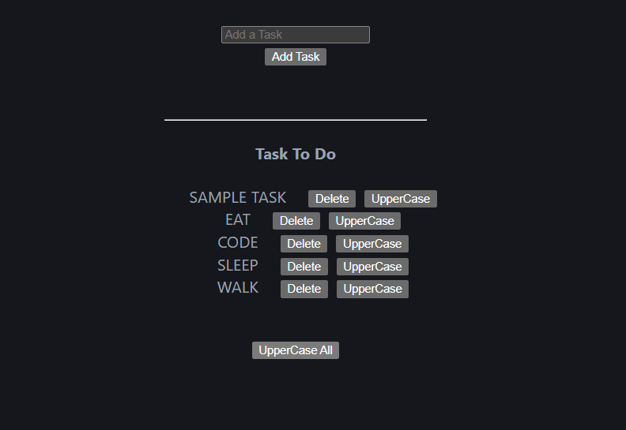

# 📝 React Todo App

A dynamic Todo List built with React that allows users to add, delete, and update tasks. This project demonstrates core React concepts like state management, list rendering, and event handling using hooks.

---

## 📸 Preview



---


## 🚀 Tech Stack

* React
* Vite
* JavaScript
* CSS

---

## ✨ Features

* ➕ Add new tasks
* ❌ Delete tasks
* 🔤 Convert individual tasks to uppercase
* 🔠 Convert all tasks to uppercase
* 🆔 Unique task IDs using `uuid`
* ⚡ Real-time UI updates

---

## 📚 What I Learned

* Using `useState` for state management
* Handling user input and events
* Rendering lists dynamically
* Updating state using functional updates
* Managing unique keys in React

---


## ▶️ Run Locally

Clone the project:

```bash id="qk5r2g"
git clone https://github.com/shanusingh01/react-todo-app.git
```

Go to project folder:

```bash id="xq8k9d"
cd react-todo-app
```

Install dependencies:

```bash id="o2v1na"
npm install
```

Run the project:

```bash id="k9z7mb"
npm run dev
```

---

## 📌 Note

This is a beginner-level project built while learning React fundamentals and CRUD operations.

---

## ⭐ Future Improvements

* ✏️ Edit task feature
* ✅ Mark task as completed
* 💾 Save tasks using localStorage
* 🎨 Improve UI design
* 📱 Make responsive for mobile

---
